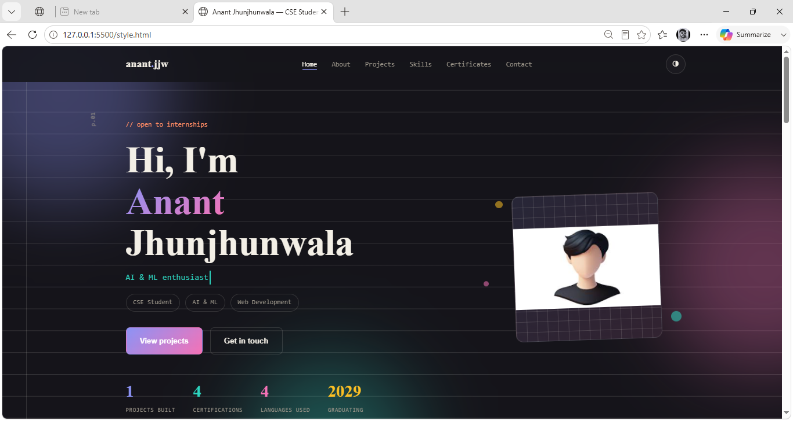

# 🌐 Anant Jhunjhunwala - Portfolio Website

A modern, responsive personal portfolio website built using **HTML, CSS, and JavaScript** to showcase my skills, projects, and journey as a Computer Science Engineering student.

## 🚀 Live Demo

🔗 Add your deployed website link here:
https://your-portfolio-link.vercel.app

---

## 📸 Preview

> Add a screenshot of your portfolio here.

Example:


---

## ✨ Features

- 🎨 Modern and responsive UI
- 🌙 Dark / Light mode
- 📱 Mobile-friendly design
- ⚡ Smooth scrolling animations
- 📊 Animated statistics
- ⌨️ Typewriter effect
- 📂 Project filtering
- 📜 About section
- 🛠 Skills section
- 📄 Certificates section
- 📧 Contact form using Formspree
- 🔝 Back-to-top button

---

## 🛠 Built With

- HTML5
- CSS3
- JavaScript (Vanilla)
- Formspree
- Google Fonts

---

## 📂 Project Structure

```
Portfolio/
│
├── index.html 
└── README.md
```

---

## 💻 Getting Started

### Clone the repository

```bash
git clone https://github.com/anant0987/portfolio.git
```

### Open the project

Simply open **index.html** in your browser.

No installation required.

---

## 📧 Contact

**Anant Jhunjhunwala**

📩 Email:
anantjhunjhunwala344@gmail.com

💼 LinkedIn:
https://linkedin.com/in/anantjhunjhunwala

🐙 GitHub:
https://github.com/anant0987

---

## 🎯 Future Improvements

- Add more real-world projects
- Blog section
- Resume download
- Project search
- Multi-language support
- Better accessibility
- Backend integration
- Visitor analytics

---

## 🤝 Contributions

Suggestions and contributions are always welcome.

Fork the repository and submit a Pull Request.

---

## ⭐ Support

If you like this project, don't forget to give it a **⭐ Star** on GitHub.

---

## 📄 License

This project is licensed under the MIT License.

---

### Made with ❤️ by Anant Jhunjhunwala
